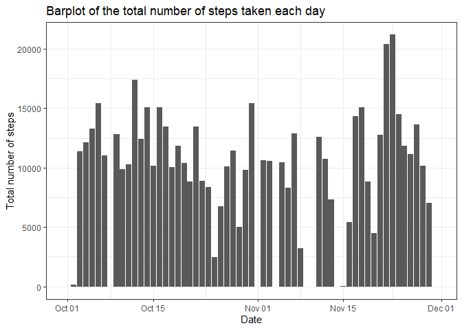
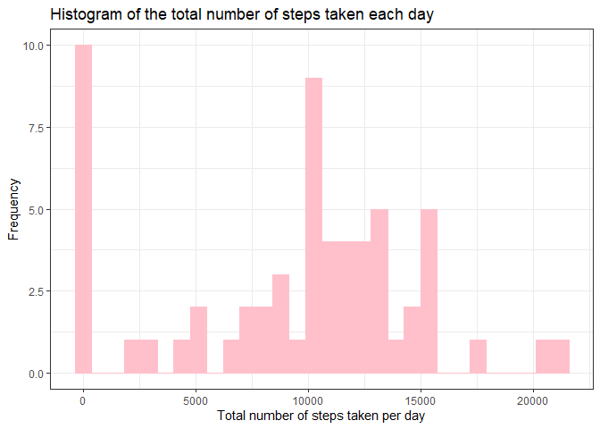
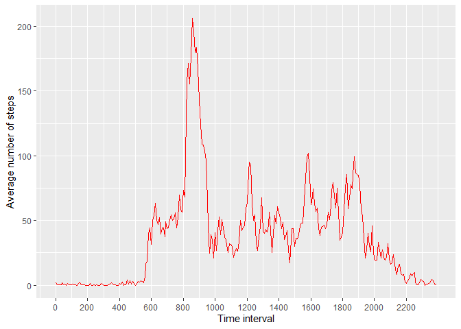
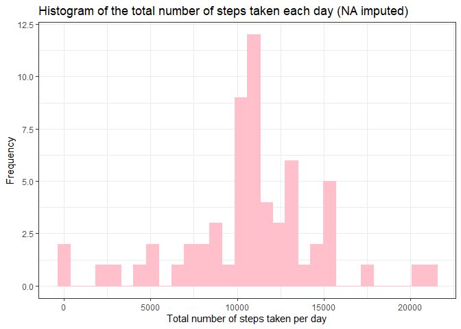
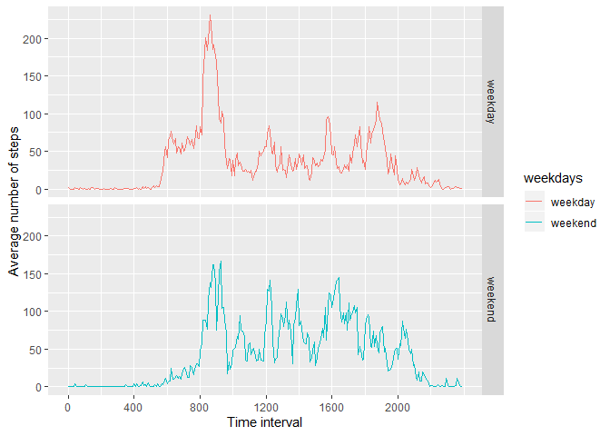

Library loaded

```r
library(data.table)
library(dplyr)
```

```
## 
## Attaching package: 'dplyr'
```

```
## The following objects are masked from 'package:data.table':
## 
##     between, first, last
```

```
## The following objects are masked from 'package:stats':
## 
##     filter, lag
```

```
## The following objects are masked from 'package:base':
## 
##     intersect, setdiff, setequal, union
```

```r
library(ggplot2)
```

## Loading and preprocessing the data


```r
unzip("activity.zip")  #unzip data to csv file
activity <- read.csv("activity.csv",header=TRUE,na.strings = "NA")
activity$date <- as.Date(activity$date,"%Y-%m-%d")
activity <- transform(activity,interval=factor(interval))
activity <- as.data.table(activity)
```

## What is mean total number of steps taken per day?
1.Calculate the total number of steps taken per day


```r
activity_day <- group_by(activity,date)
sum_step_day <- summarize(activity_day,sum=sum(steps,na.rm=TRUE))
ggplot(sum_step_day,aes(date,sum))+geom_bar(stat="identity")+theme_bw()+labs(x="Date",y="Total number of steps",title="Barplot of the total number of steps taken each day")
```

<!-- -->

2.Make a histogram of the total number of steps taken each day


```r
ggplot(sum_step_day,aes(sum))+geom_histogram(color="pink",fill="pink",bins=30)+theme_bw()+labs(x="Total number of steps taken per day",y="Frequency",title="Histogram of the total number of steps taken each day")
```

<!-- -->

3.Calculate and report the mean and median of the total number of steps taken per day


```r
mean <- mean(sum_step_day$sum)
median <- median(sum_step_day$sum)
```
The mean of the total number of steps taken per day is **9354.2295082**, and the median is **10395**.

## What is the average daily activity pattern?
1.Make a time series plot of the 5-minute interval (x-axis) and the average number of steps taken, averaged across all days (y-axis)


```r
activity_interval <- group_by(activity,interval)
ave_step_interval <- summarize(activity_interval,average=mean(steps,na.rm=TRUE))
ggplot(ave_step_interval,aes(x=as.integer(interval),y=average))+geom_line(color="red")+labs(x="Time interval",y="Average number of steps")+scale_x_continuous(breaks=seq(1,288,24),labels=ave_step_interval$interval[seq(1,288,24)])
```

<!-- -->

2.Which 5-minute interval, on average across all the days in the dataset, contains the maximum number of steps?


```r
max_step_interval <- filter(ave_step_interval,average==max(average))
```
The 5-minute interval **835** has a  maximum average number of steps of **206.1698113**.

## Imputing missing values
1.Calculate and report the total number of missing values in the dataset


```r
sum_na <- sum(is.na(activity$steps))
```
The total number of missing values in the data set is **2304**

2.Devise a strategy for filling in all of the missing values in the dataset.
Impute missing values based on average number of steps in particular 5-minutes interval. 

3. Create a new dataset that is equal to the original dataset but with the missing data filled in.


```r
activity_without_na <- activity
activity_without_na$steps <- as.numeric(activity_without_na$steps)
for(i in 1:nrow(activity)){
  if(is.na(activity[i,"steps"])==TRUE){
    activity_without_na[i,"steps"] <- filter(ave_step_interval,interval==activity[i,"interval"][[1]]) %>% select(average)
  }
}
```

4.Make a histogram of the total number of steps taken each day and Calculate and report the mean and median total number of steps taken per day. 


```r
activityNoNA_day <- group_by(activity_without_na,date)
sum_stepNoNA_day <- summarize(activityNoNA_day,sum=sum(steps))
ggplot(sum_stepNoNA_day,aes(sum))+geom_histogram(color="pink",fill="pink",bins=30)+theme_bw()+labs(x="Total number of steps taken per day",y="Frequency",title="Histogram of the total number of steps taken each day (NA imputed)")
```

<!-- -->

```r
mean_NoNA <- mean(sum_stepNoNA_day$sum)
median_NoNA <- median(sum_stepNoNA_day$sum)
```
The mean of the total number of steps taken per day after missing value imputation is 1.0766189\times 10^{4}, and the median is 1.0766189\times 10^{4}. Both the mean and median value increased by compared to the mean with missing value.

## Are there differences in activity patterns between weekdays and weekends?
1.Create a new factor variable in the dataset with two levels – “weekday” and “weekend” indicating whether a given date is a weekday or weekend day.


```r
is_weekday <- function(x){
  if(weekdays(x) %in% c("Saturday","Sunday")){
    result <- "weekend"
  }else{
    result <- "weekday"
  }
}
activity_without_na <- mutate(activity_without_na,weekdays=sapply(date,is_weekday))
```

2.Make a panel plot containing a time series plot of the 5-minute interval (x-axis) and the average number of steps taken, averaged across all weekday days or weekend days (y-axis).


```r
activity_without_na <- transform(activity_without_na,weekdays=factor(weekdays))
activityNoNA_interval <- group_by(activity_without_na,interval,weekdays)
ave_stepNoNA_interval <- summarize(activityNoNA_interval,average=mean(steps))
ggplot(ave_stepNoNA_interval,aes(x=as.integer(interval),y=average,color=weekdays))+geom_line()+facet_grid(weekdays~.)+labs(x="Time interval",y="Average number of steps")+scale_x_continuous(breaks=seq(1,288,48),labels=ave_step_interval$interval[seq(1,288,48)])
```

<!-- -->
